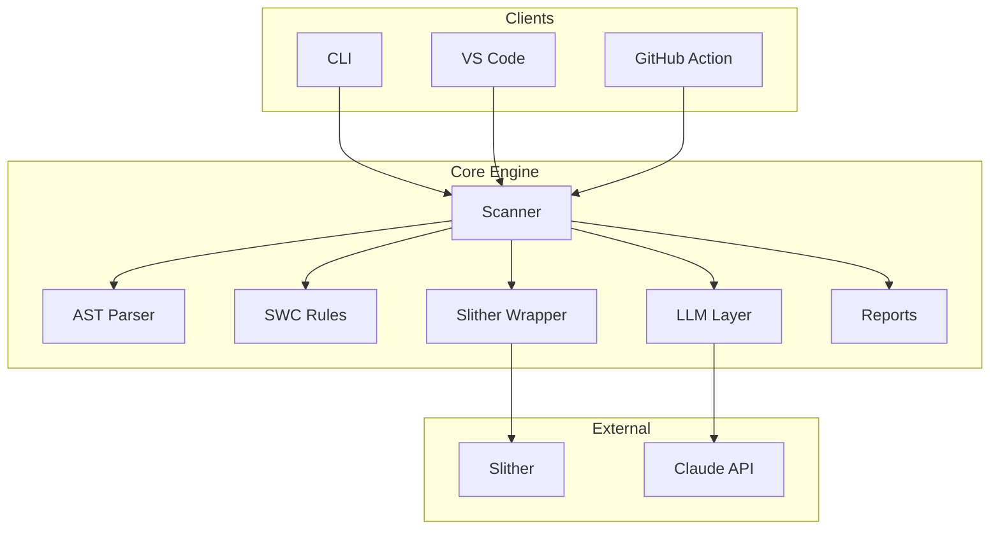
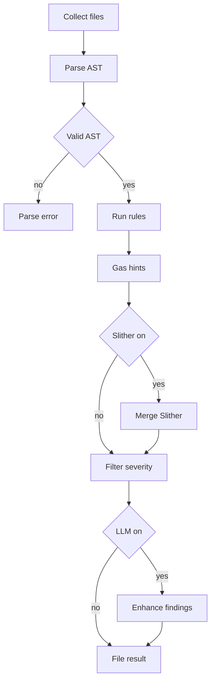
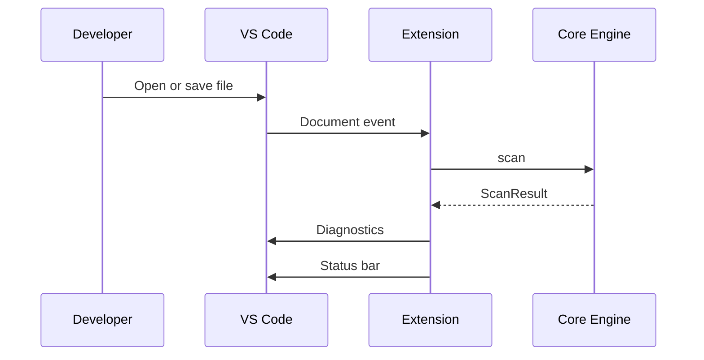
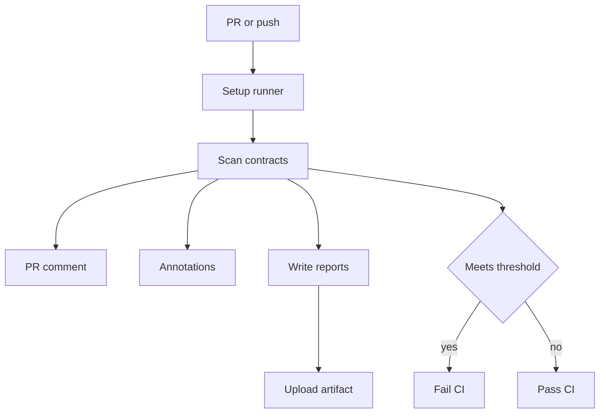
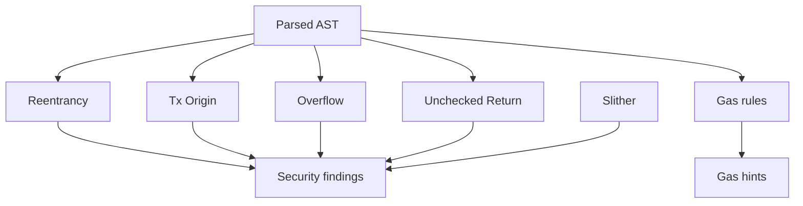

# ChainProof Documentation

**Smart Contract Audit Copilot** — real-time vulnerability scanner, gas advisor, and audit report generator for Solidity.

---

## Table of Contents

- [Overview](#overview)
- [Architecture](#architecture)
- [Scan Pipeline](#scan-pipeline)
- [Repository Layout](#repository-layout)
- [Installation](#installation)
- [CLI Reference](#cli-reference)
- [VS Code Extension](#vs-code-extension)
- [GitHub Action](#github-action)
- [Vulnerability Rules](#vulnerability-rules)
- [Data Model](#data-model)
- [Configuration](#configuration)
- [Plugin API](#plugin-api)
- [Development Guide](#development-guide)
- [Roadmap](#roadmap)
- [License](#license)

---

## Overview

ChainProof helps developers catch smart contract vulnerabilities early — in the editor, terminal, and CI pipeline — without waiting weeks or paying tens of thousands for a full audit.

| Problem                                  | ChainProof response                                 |
| ---------------------------------------- | --------------------------------------------------- |
| $1.8B+ lost to exploits in 2023          | Built-in SWC-aligned detectors + optional Slither   |
| 6-week audit queues at $30k–$100k        | Instant scans on every save and PR                  |
| No tooling for indie devs and small DAOs | Free, open-source CLI, extension, and GitHub Action |

### What ChainProof does

- Parses Solidity source into an AST and runs custom vulnerability rules
- Optionally integrates [Slither](https://github.com/crytic/slither) for broader static analysis
- Flags gas optimization opportunities separately from security findings
- Optionally sends critical/high findings to Claude for contextual explanations and fixes
- Emits reports as terminal tables, JSON, or Markdown

> **Disclaimer:** ChainProof is a developer tool, not a substitute for a professional security audit. Always have critical contracts reviewed by qualified humans before mainnet deployment.

---

## Architecture

All user-facing packages share a single scanning engine (`@chainproof/core`). Every interface calls the same `scan()` function with a `ScanConfig` object.



### Package responsibilities

| Package                     | NPM name            | Purpose                                                           |
| --------------------------- | ------------------- | ----------------------------------------------------------------- |
| `packages/core`             | `@chainproof/core`  | AST parsing, rules, Slither wrapper, LLM layer, report generation |
| `packages/cli`              | `@chainproof/cli`   | Command-line interface (`scan`, `check`, `init`)                  |
| `packages/vscode-extension` | `chainproof-vscode` | Inline diagnostics, auto-scan on save, audit report command       |
| `packages/github-action`    | —                   | CI gate, PR comments, workflow annotations, artifacts             |

---

## Scan Pipeline

Each `.sol` file passes through the pipeline below. Directory targets are expanded recursively before scanning.



### Severity levels

Findings are ranked for filtering and CI gating:

| Severity   | Rank | Typical use                                       |
| ---------- | ---- | ------------------------------------------------- |
| `critical` | 5    | Immediate blocker — e.g. reentrancy               |
| `high`     | 4    | Must fix before deploy — e.g. `tx.origin` auth    |
| `medium`   | 3    | Should review — e.g. unchecked return values      |
| `low`      | 2    | Minor issues                                      |
| `info`     | 1    | Informational notes                               |
| `gas`      | 0    | Optimization hints (not security vulnerabilities) |

---

## Repository Layout

```
chainproof/
├── packages/
│   ├── core/
│   │   └── src/
│   │       ├── ast/          # Solidity parser + Slither wrapper
│   │       ├── rules/        # SWC vulnerability detectors + gas optimizer
│   │       ├── llm/          # Claude-powered explanation layer
│   │       ├── report/       # Markdown / JSON / table generators
│   │       ├── scanner.ts    # Main scan orchestrator
│   │       └── types.ts      # Shared TypeScript interfaces
│   ├── cli/                  # `chainproof` CLI
│   ├── vscode-extension/     # VS Code extension
│   └── github-action/        # GitHub Action for CI/CD
├── examples/
│   └── contracts/
│       ├── VulnerableVault.sol   # Intentionally vulnerable (test target)
│       └── SecureVault.sol       # Patched reference implementation
└── .github/workflows/audit.yml   # Example CI workflow
```

---

## Installation

### Prerequisites

| Tool               | Version | Required for                        |
| ------------------ | ------- | ----------------------------------- |
| Node.js            | ≥ 18    | CLI, extension, core engine         |
| Python             | ≥ 3.10  | Slither (optional)                  |
| `slither-analyzer` | latest  | Extended static analysis (optional) |

```bash
# Optional but recommended
pip install slither-analyzer
```

### From source (development)

```bash
git clone https://github.com/your-org/chainproof
cd chainproof
npm install          # installs all workspaces
npm run build        # compiles TypeScript in all packages
```

### Global CLI install

```bash
npm install -g @chainproof/cli
```

---

## CLI Reference

### `chainproof scan`

Scan one or more `.sol` files or directories.

```bash
chainproof scan contracts/
chainproof scan contracts/ --format markdown --output audit.md
chainproof scan contracts/ --api-key YOUR_ANTHROPIC_KEY
chainproof scan contracts/ --min-severity high --no-slither
```

| Flag                     | Default              | Description                            |
| ------------------------ | -------------------- | -------------------------------------- |
| `--no-slither`           | Slither on           | Skip Slither even if installed         |
| `--no-llm`               | LLM on if key set    | Skip Claude enhancement                |
| `--api-key <key>`        | `$ANTHROPIC_API_KEY` | Anthropic API key                      |
| `--min-severity <level>` | `low`                | Filter findings below this level       |
| `--format <format>`      | `table`              | Output: `table`, `json`, or `markdown` |
| `--output <file>`        | stdout               | Write report to file                   |

**Exit codes:** `0` if no critical/high findings; `1` if critical or high issues are detected.

When using the default `table` format without `--output`, a full Markdown report is also saved to `chainproof-report.md`.

### `chainproof check`

Fast pass/fail check for CI. Only reports critical and high findings. LLM is always disabled.

```bash
chainproof check contracts/
```

Exits `1` on any critical or high severity finding.

### `chainproof init`

Creates a `.chainproofrc.json` config file in the current directory.

```bash
chainproof init
```

---

## VS Code Extension

Install from the VS Code Marketplace (search **ChainProof**) or load from `packages/vscode-extension` during development.

### Commands

| Command                             | Description                        |
| ----------------------------------- | ---------------------------------- |
| `ChainProof: Scan Current File`     | Scan the active `.sol` file        |
| `ChainProof: Scan Entire Workspace` | Scan all open Solidity files       |
| `ChainProof: Generate Audit Report` | Write `chainproof-audit-report.md` |
| `ChainProof: Clear Diagnostics`     | Remove all ChainProof diagnostics  |

### Behavior



Findings appear in the **Problems** panel with severity mapped to VS Code diagnostic levels:

- `critical` / `high` → Error
- `medium` → Warning
- `low` / `info` / `gas` → Information or Hint

### Settings

Configure under **Settings → ChainProof**:

| Setting                   | Default | Description                                    |
| ------------------------- | ------- | ---------------------------------------------- |
| `chainproof.enableOnSave` | `true`  | Auto-scan on save                              |
| `chainproof.useSlither`   | `true`  | Run Slither if available                       |
| `chainproof.useLLM`       | `false` | Enhance findings with Claude                   |
| `chainproof.apiKey`       | `""`    | Anthropic API key (or `ANTHROPIC_API_KEY` env) |
| `chainproof.minSeverity`  | `low`   | Minimum severity to display                    |

---

## GitHub Action

Add ChainProof to your workflow to gate merges on security findings.

```yaml
# .github/workflows/audit.yml
- name: ChainProof Audit
  uses: your-org/chainproof@v1
  with:
    targets: "contracts/"
    min-severity: "high"
    use-slither: "true"
    api-key: ${{ secrets.ANTHROPIC_API_KEY }}
  env:
    GITHUB_TOKEN: ${{ secrets.GITHUB_TOKEN }}
```

### Action inputs

| Input           | Default      | Description                            |
| --------------- | ------------ | -------------------------------------- |
| `targets`       | `contracts/` | Space-separated paths to scan          |
| `min-severity`  | `high`       | Fail CI at this severity or above      |
| `use-slither`   | `true`       | Run Slither if installed on runner     |
| `api-key`       | `""`         | Anthropic API key for LLM enhancement  |
| `report-format` | `markdown`   | PR comment format                      |
| `upload-report` | `true`       | Write reports to `chainproof-reports/` |
| `fail-on-gas`   | `false`      | Fail CI when gas hints are present     |

### Action outputs

| Output           | Description                        |
| ---------------- | ---------------------------------- |
| `critical-count` | Number of critical findings        |
| `high-count`     | Number of high findings            |
| `total-count`    | Total findings including gas hints |
| `report-path`    | Path to generated Markdown report  |

### CI workflow



The action will:

- Scan all `.sol` files under `targets`
- Post or update a summary comment on pull requests
- Annotate changed files with inline findings
- Upload the full audit report as a GitHub Actions artifact
- Fail the job when findings meet or exceed `min-severity`

See [`.github/workflows/audit.yml`](.github/workflows/audit.yml) for a complete working example.

---

## Vulnerability Rules

### Built-in detectors

| ID     | SWC                                            | Name                         | Severity | Detection approach                                 |
| ------ | ---------------------------------------------- | ---------------------------- | -------- | -------------------------------------------------- |
| CP-107 | [SWC-107](https://swcregistry.io/docs/SWC-107) | Reentrancy                   | Critical | External call before state update in same function |
| CP-115 | [SWC-115](https://swcregistry.io/docs/SWC-115) | `tx.origin` authentication   | High     | `tx.origin` used in `require` or access control    |
| CP-101 | [SWC-101](https://swcregistry.io/docs/SWC-101) | Integer overflow / underflow | High     | Arithmetic on pragma `< 0.8` without SafeMath      |
| CP-104 | [SWC-104](https://swcregistry.io/docs/SWC-104) | Unchecked call return value  | Medium   | `.call` / `.send` return value not checked         |
| GAS-\* | —                                              | Gas optimizations            | Gas      | Storage in loops, packing, `keccak256`, etc.       |

When Slither is installed, all [Slither detectors](https://github.com/crytic/slither/wiki/Detector-Documentation) are merged in with deduplication by line + title. Slither findings are prefixed with `SLITHER-`.

### Rule detection flow



### Example contracts

`examples/contracts/VulnerableVault.sol` is intentionally vulnerable and should report critical + high findings. `SecureVault.sol` is the patched reference and should scan clean.

```bash
# After building from source
node packages/cli/dist/cli.js scan examples/contracts/VulnerableVault.sol
node packages/cli/dist/cli.js scan examples/contracts/SecureVault.sol
```

---

## Data Model

### `Finding`

Each detected issue is a `Finding` object:

```typescript
interface Finding {
  id: string; // e.g. "CP-107"
  title: string;
  description: string;
  recommendation: string;
  severity: "critical" | "high" | "medium" | "low" | "info" | "gas";
  file: string;
  line: number;
  lineEnd?: number;
  snippet?: string;
  swcId?: string; // e.g. "SWC-107"
  llmEnhanced?: boolean;
}
```

### `ScanResult`

```typescript
interface ScanResult {
  version: string;
  timestamp: string;
  files: FileScanResult[];
  summary: {
    critical: number;
    high: number;
    medium: number;
    low: number;
    info: number;
    gas: number;
    total: number;
  };
}
```

### Programmatic usage

```typescript
import { scan, generateMarkdownReport } from "@chainproof/core";

const result = await scan({
  targets: ["contracts/MyToken.sol"],
  useSlither: true,
  useLLM: false,
  minSeverity: "low",
});

console.log(generateMarkdownReport(result));
```

---

## Configuration

### Environment variables

| Variable            | Used by                | Description                        |
| ------------------- | ---------------------- | ---------------------------------- |
| `ANTHROPIC_API_KEY` | CLI, extension, action | Claude API key for LLM enhancement |

### `.chainproofrc.json`

Generated by `chainproof init`:

```json
{
  "targets": ["contracts/"],
  "useSlither": true,
  "useLLM": true,
  "minSeverity": "low",
  "outputFormat": "markdown",
  "output": "audit-report.md"
}
```

### LLM enhancement

When enabled, critical and high findings are sent to Claude (`claude-sonnet-4-20250514`) for:

- A developer-friendly explanation of the risk in context
- A copy-paste-ready fix for the specific code
- A brief real-world exploit scenario

```bash
export ANTHROPIC_API_KEY=sk-ant-...
chainproof scan contracts/ --llm
```

LLM calls are best-effort — if the API fails, the original scanner finding is returned unchanged.

---

## Plugin API

ChainProof is extensible. Teams can ship custom detection rules via plugins without modifying the core engine. Plugins enable:

- **Protocol-specific rules** — Detect usage of non-approved oracle wrappers or deprecated internal functions
- **Proprietary patterns** — Auditing firms can bundle closed-source detection logic
- **Research & prototyping** — Test new vulnerability detectors before contributing to core
- **Team standards** — Enforce internal coding practices across projects

### Plugin structure

A plugin is an NPM package or `.js` file that exports a `ChainProofPlugin` object:

```typescript
interface ChainProofPlugin {
  name: string; // e.g. "myteam-rules"
  version: string; // semantic version
  rules: PluginRule[]; // array of detection rules
}

interface PluginRule {
  id: string; // e.g. "MYTEAM-001"
  title: string; // human-readable title
  severity: Severity; // "critical" | "high" | "medium" | "low" | "info"
  description: string; // why this is dangerous
  recommendation?: string; // how to fix it
  detect: (ast: ASTNode, source: string, filePath: string) => Finding[];
}
```

### Example plugin

See `examples/plugins/simple-rules/index.js` for a complete working example with two simple rules.

**To run the example:**

```bash
# From the root directory
npm run build
chainproof scan examples/contracts/ --plugin examples/plugins/simple-rules/index.js
```

### Loading plugins

Plugins can be loaded in three ways:

#### CLI: `--plugin` flag

```bash
# Load a single plugin
chainproof scan contracts/ --plugin ./my-rules.js

# Load multiple plugins (repeat the flag)
chainproof scan contracts/ --plugin ./my-rules.js --plugin @myteam/chainproof-rules

# Load a plugin via npm package
npm install @myteam/chainproof-rules
chainproof scan contracts/ --plugin @myteam/chainproof-rules
```

#### Config file: `.chainproofrc.json`

Create a `.chainproofrc.json` in your project root:

```json
{
  "targets": ["contracts/"],
  "useSlither": true,
  "useLLM": false,
  "plugins": ["./local-rules/my-plugin.js", "@myteam/chainproof-rules"]
}
```

Then scan automatically picks up the plugins:

```bash
chainproof scan  # plugins from .chainproofrc.json
```

#### Programmatic: `ScanConfig.plugins`

```typescript
import { scan, loadPlugins } from "@chainproof/core";

const plugins = loadPlugins(["@myteam/rules", "./local/rules.js"]);

const result = await scan({
  targets: ["contracts/"],
  useSlither: true,
  plugins,
});
```

### Writing a plugin

**Step 1: Create a `.js` or `.ts` file with a plugin object:**

```javascript
// my-custom-rules.js
const plugin = {
  name: "my-custom-rules",
  version: "1.0.0",
  rules: [
    {
      id: "CUSTOM-001",
      title: "Disallow magic numbers",
      severity: "medium",
      description: "Magic numbers reduce code clarity and maintainability.",
      recommendation: "Define named constants instead.",
      detect(ast, source, filePath) {
        // Return an array of Finding objects
        return [];
      },
    },
  ],
};

module.exports = plugin;
```

**Step 2: Use the visitor pattern to traverse the AST:**

The `ast` parameter is a Solidity AST (from `@solidity-parser/parser`). ChainProof's internal rules use this pattern:

```javascript
detect(ast, source, filePath) {
  const findings = [];

  // Helper to walk the AST
  function visit(node, callback) {
    if (!node) return;
    callback(node);
    for (const key in node) {
      if (Array.isArray(node[key])) {
        node[key].forEach(child => visit(child, callback));
      } else if (typeof node[key] === "object") {
        visit(node[key], callback);
      }
    }
  }

  visit(ast, (node) => {
    if (node.type === "FunctionDefinition") {
      // Detect something about this function
      if (/* your condition */) {
        findings.push({
          id: "CUSTOM-001",
          title: "...",
          severity: "medium",
          description: "...",
          recommendation: "...",
          file: filePath,
          line: node.loc?.start?.line || 0,
          snippet: source.split("\n")[node.loc?.start?.line - 1],
        });
      }
    }
  });

  return findings;
}
```

**Step 3: Publish as an NPM package (optional):**

```bash
npm init -y
npm publish
```

Then users can install and use it:

```bash
npm install @myteam/chainproof-rules
chainproof scan contracts/ --plugin @myteam/chainproof-rules
```

### Plugin error handling

If a plugin fails to load or throws an error during detection:

- The warning is logged to stderr (non-fatal)
- Scanning continues with other rules and plugins
- The scan does not fail

```
[ChainProof] Failed to load plugin "my-plugin.js": Cannot find module
[ChainProof] Plugin "my-rules" rule "CUSTOM-001" failed: TypeError ...
```

This design ensures plugins are optional enhancements, not blockers.

### Plugin types

You can import the plugin types for TypeScript projects:

```typescript
import type {
  ChainProofPlugin,
  PluginRule,
  Finding,
  ASTNode,
  Severity,
} from "@chainproof/core";
```

---

## Development Guide

### Build and test

```bash
npm install
npm run build
npm run lint
npm run test
```

### Adding a new rule

1. Create `packages/core/src/rules/swcXXX-your-rule.ts`
2. Export a `detectXxx(ast, source, filePath): Finding[]` function using the AST visitor pattern
3. Import and call it in `packages/core/src/scanner.ts`
4. Add an entry to the [Vulnerability Rules](#vulnerability-rules) table
5. Add or update an example in `examples/contracts/` to exercise the rule

**Rule template:**

```typescript
import { visit, getSnippet } from "../ast/parser";
import type { Finding } from "../types";
import type { ASTNode } from "@solidity-parser/parser";

export function detectMyRule(
  ast: ASTNode,
  source: string,
  filePath: string,
): Finding[] {
  const findings: Finding[] = [];

  visit(ast, {
    // Match relevant AST node types
    FunctionDefinition(node: ASTNode) {
      // ... detection logic ...
      findings.push({
        id: "CP-XXX",
        swcId: "SWC-XXX",
        title: "Rule title",
        description: "Why this is dangerous",
        recommendation: "How to fix it",
        severity: "high",
        file: filePath,
        line: 0,
        snippet: getSnippet(source, node),
      });
    },
  });

  return findings;
}
```

### Workspace scripts

| Script            | Description                        |
| ----------------- | ---------------------------------- |
| `npm run build`   | Build all packages                 |
| `npm run test`    | Run tests in all workspaces        |
| `npm run lint`    | ESLint on `packages/*/src/**/*.ts` |
| `npm run dev:cli` | Watch-build the CLI package        |

---

## Roadmap

- [ ] SWC-103: Floating pragma detector
- [ ] SWC-116: Timestamp dependency
- [ ] SWC-120: Weak randomness (`block.timestamp` / `blockhash`)
- [ ] Foundry test generation for detected vulnerabilities
- [ ] Hardhat plugin
- [ ] SARIF output for GitHub Security tab
- [ ] Web dashboard with project-level history
- [ ] Support for Vyper

---

## License

MIT © ChainProof Contributors
